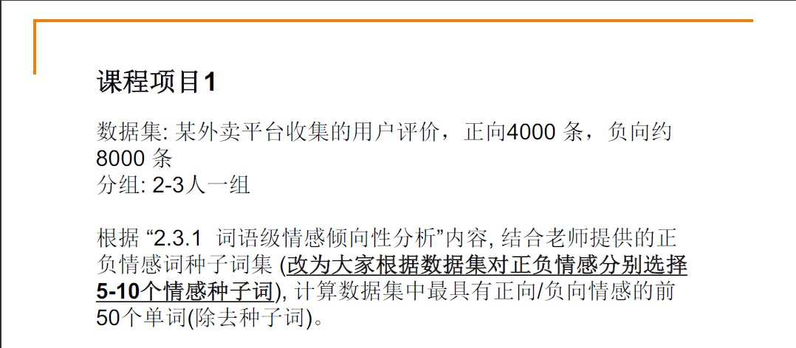

# emotional-tendency

武汉大学国家网络安全学院-社会计算 课程项目1



0. 环境：Windows10, python3.8.3
1. 安装依赖
    + jieba==0.42.1
    + paddle==2.1.3
    + OpenHowNet==1.0
    + anytree==2.4.3
    + tqdm==4.31.1
    + requests==2.22.0
```
    pip install -r requirements.txt
```

## 文件说明
+ 程序入口：

    `src/frequency.py`: 求词频
    
    `src/main_sopmi.py`: 通过计算词汇和种子词的SO-PMI判断情感倾向性

    `src/main_sopmi+.py`: 通过计算词汇和种子词的引入词间距的SO-PMI判断情感倾向性
    
    `src/main_openhownet.py`: 通过HowNet库中词汇和种子词的相关性判断情感倾向性

+ 数据：
    `/data/comment.csv`: 外卖评论数据

    `/data/seeds.csv`: 种子词数据

+ 结果：
    `/data/result_pos{}.csv` & `/data/result_neg{}.csv` : 全部正向词和负向词的数据，按极端性从上到下依次排列（{}中是应用的方法名称）

    `/data/frequency.csv`: 词频统计，降序排列
    
    `/data/result{}.csv`: 正向词负向词前50名的数据，词汇出现均大于10次（{}中是应用的方法名称)

+ 其他文件

## 方法解析

### SO-PMI

点互信息(PMI)用来衡量两个事物之间的相关性，两个事物同时出现的概率越大，其相关性越大

+ 计算 word1 和 word2 的点互信息(PMI)：

    =log_2[\frac{P(word_1,word_2)}{P(word_1)×P(word_2)}])

    其中: 

    P(word) 是word在出现概率，即word出现的条目占总条目的比

    P(word1, word2) 是 word1, word2 共同出现的条目占总条目的比例。即word1, word2 共现概率

+ +1平滑

    为了避免因为样本太少而产生0概率事件，所有出现次数均默认比实际出现次数大1

+ 计算 word 的情感倾向点互信息(SO-PMI):

    $$
    SO-PMI(word) = \sum_{seed \in positive\_seeds} PMI(seed, word) - \sum_{seed \in negative\_seeds} PMI(seed, word)
    $$

    其中: positive_seeds 与 negative_seeds 为正向和负向种子词集合


### SO-PMI 引入词间距

+ 词间距计算：

    当两词共现时
    $$
    d(word_{1}, word_{2}) = min(|index_{word1} - index_{word2}|)
    $$

    其中:

    index_word 为词汇在某条评论中的下标

    (特别说明，本项目中最大距离设置为100000，远大于最长的评论的长度)

+ SO-PMI:

    加入词间距后对SO-PMI的修正

    $$
    SO-PMI(word, seeds_{i}) = \sum_{seed \in seeds_{i}} \frac{count(comment) * hit(word, seed)}{count(seeds_{i}) * hit(word) * hit(seed) * d(word_{1}, word_{2})}
    $$

    其中:

    count(x)为x的数量

    hit(word) 为有$word$出现的评论的数目
    
    seed_i 为第i类感情的种子词的集合

+ 特殊说明：这种方法的SO-PMI值分别对不同的情感计算，同一个词对每一种情感有一个不同的SO-PMI值，所以可以进一步将情感细化。


### HowNet

HowNet是一个中文语义知识库，这里调用了OpenHowNet库

+ 词汇情感倾向

    定义：

    $$
    Polarity(word) = \frac{1}{count(pos\_seeds)} * \sum_{seed \in pos\_seeds} sim(word, seed) - \frac{1}{count(neg\_seeds)} * \sum_{seed \in pos\_seeds} sim(word, seed)
    $$

    其中：
    pos_seeds 与 neg_seeds 为正向与负向种子词的集合

    sim(word1,, word2) 为 word1 和 word2 在HowNet中的相似度


## 模块说明

+ dataop

    该模块包含所有.csv文件的读写，jieba分词，数据排序 的内容

+ globalv

    所有全局变量

+ init

    初始化

+ frequency

    词频统计

+ OHN

    OpenHowNet 方法相关内容

    ```python
    def OHN(data: list) -> dict:...

    def Polarity(word: str, HowNet) -> :...
    ```

    + `(func) OHN.OHN(data: list) -> dict`
        
        该函数处理所有词汇与这组种子在HowNet中的Polarity
    
            @param data list[...{"lable": (int), "review": (list[(str)])}...]
            
            处理后的评论数据

            @return word_lib(dict)
            
            在HowNet中存在的词汇及其在该组种子下的极端值(Polarity)

    + `(func) OHN.Polarity(word: str, HowNet)`

        该函数计算特定词汇在该组种子下的极端值

            @param word(str)

            需要求Polarity的词汇

            @param HowNet(HowNetDict)

            @return Polarity(float)

+ SOPMI

    SOPMI 方法相关内容

    ```python
    class Word:
        def __init__(self, word_name: str):...

        def isInComment(self, cnt_seeds: dict):...

        def UpdateDist(self, dist_seeds: dict):...

        def CalSOPMI(self, cnt_comment: float, p_seeds: dict):...

        def CalSOPMIp(self, cnt_comment:float, cnt_seeds:dict):...

    def SOPMI(splited_data):...

    def SOPMI_d(splited_data):...

    def SpliteSOPMIp(word_sopmi):...

    ```

    + `(module) SOPMI.Word(word: str)`
        
        该模块储存一个词汇的相关统计数据

        `Word.isInComment(cnt_seeds)`

        当该词汇在一条评论中时，更新其计数数据

            @param cnt_seeds(dict)

        `Word.UpdateDist(dist_seeds:dict)`

        当该词汇在一条评论中时，更新其距离数据

            @param dist_seeds(dict)

        `Word.CalSOPMI(cnt_comment: float, p_seeds: dict)`

        计算该词汇的SOPMI值

            @param cnt_comment(float) 

            所有评论的数量

            @param p_seeds(dict)

            所有种子词独立出现的概率

            @return sopmi(float)

        `Word.CalSOPMIp(cnt_comment: float, cnt_seeds: dict)`

        计算该词在考虑距离的情况下的SOPMI值

            @param cnt_comment(float)

            @param cnt_seeds(dict)

            所有种子词出现的次数

            @return sopmi(float)

    + `(func)SOPMI.SOPMI(splited_data:list)`
        
        计算所有词汇的SOPMI值

            @param splited_data list[..., {"lable": (int), "review": (list[(str)]), ...}]

            @return word_sopmi dict

    + `(func)SOPMI.SOPMI_d`

        计算所有词汇考虑距离的SOPMI值

            @param splited_data list[..., {"lable": (int), "review": (list[(str)])}, ...]

            @return word_sopmi dict{..., word(str): tuple(sopmi_pos, sopmi_neg), ...}

    + `(func)SplitSOPMI(word_sopmi: dict)`

        将考虑距离的SOPMI方法的结果切分并排序


## 还需要完成

@zbj

1. 几种方法的结果正确性分析(我们或许可以认为HowNet的结果和好评差评中的高频词是比较正确的)
    
2. 几种方法的效率

3. 数据可视化

4. 其他可以水字数的内容


## 参考

1. \[[SO-PMI算法及其拓展](https://wsinbol.github.io/2019/10/02/SOPMI%E7%AE%97%E6%B3%95%E5%8F%8A%E5%85%B6%E6%8B%93%E5%B1%95/)\]
2. \[[OpenHowNet](https://gitee.com/thunlp/OpenHowNet#%E8%8E%B7%E5%8F%96k%E4%B8%AA%E6%9C%80%E6%8E%A5%E8%BF%91%E8%BE%93%E5%85%A5%E8%AF%8D%E7%9A%84%E8%AF%8D)\]


***施工中！！！***
